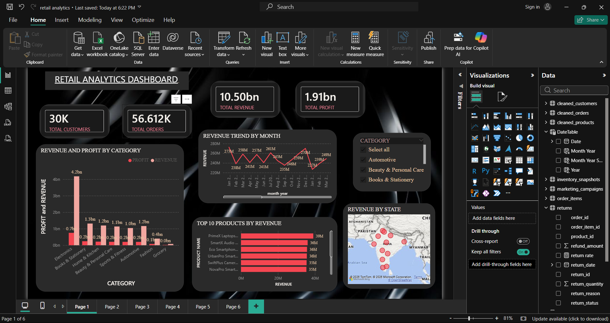
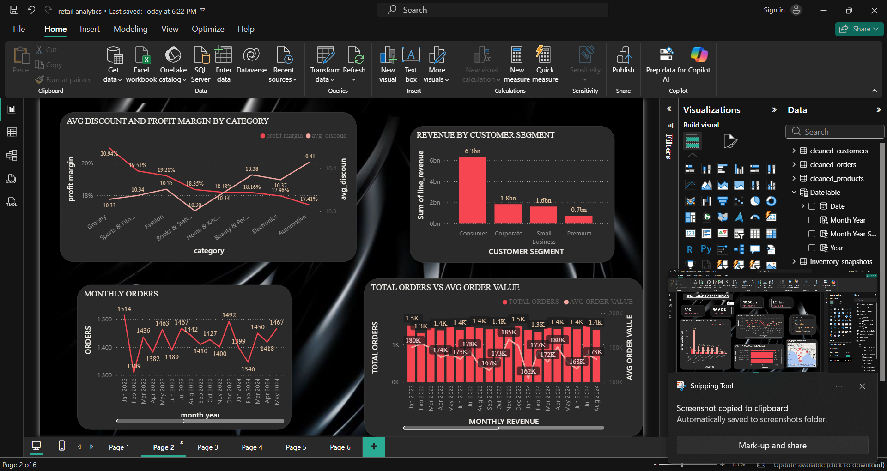
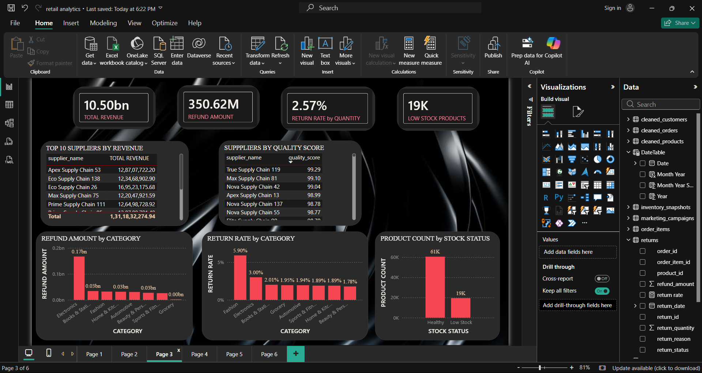
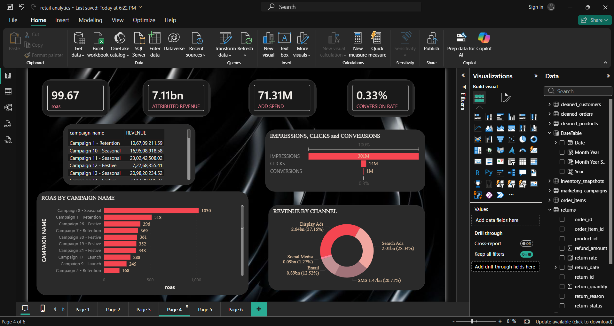
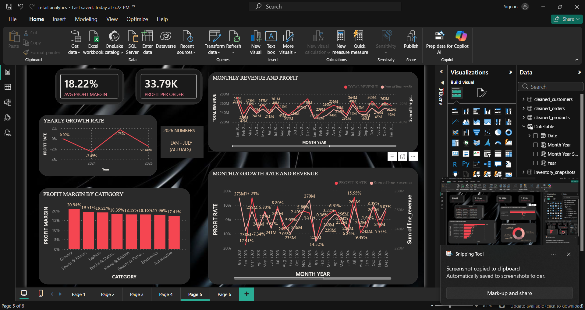
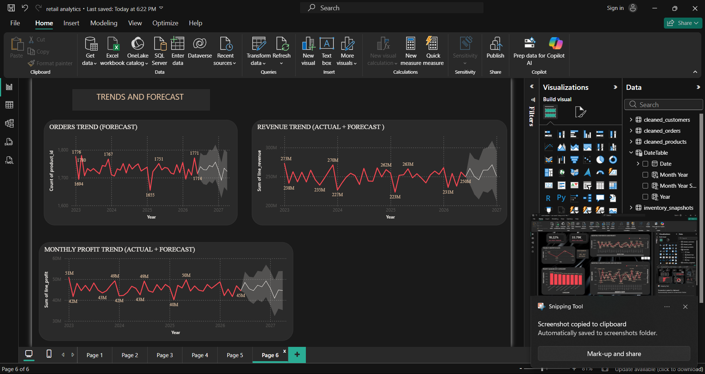

# Retail Analytics Dashboard

An end-to-end retail analytics project — Python for data cleaning & EDA, MySQL for business analysis, and a 6-page Power BI dashboard covering revenue, profitability, customers, returns, inventory, and marketing performance.

## Highlights

| Metric | Value |
|---|---|
| Total Revenue | 10.50bn |
| Total Profit | 1.91bn |
| Avg. Profit Margin | 18.22% |
| Total Orders | 56.6K |
| Total Customers | 30K |
| Return Rate | 2.57% |

## Tech Stack

Python (pandas, numpy, matplotlib, seaborn) · MySQL · Power BI (DAX, forecasting)

## What's Inside

- **`enterprises_retail_eda.ipynb`** — data cleaning, null/duplicate handling, outlier detection, feature engineering
- **`retail_analytics.sql`** — revenue, profit, customer, product, return, inventory, and marketing queries + reusable views
- **6-page Power BI dashboard** — Overview, Customers & Orders, Returns & Inventory, Marketing, Profitability Trends, Trends & Forecast

## Key Insights

- Electronics leads on profit despite not leading on revenue
- Fashion has the highest return rate of any category
- Display and Search ads drive the majority of attributed marketing revenue

More dashboard pages

